# PulseHQ AI + DGX Spark — Presentation Strategy & Architecture Guide

## Presentation Strategy Overview

**Duration:** 30 minutes
**Audience:** NVIDIA Developer Advocates
**Key constraint:** You do not have a physical DGX Spark unit — this is an architecture-driven talk, not a live demo.

### Talk Structure (30 min)

| Section | Time | Depth |
|---------|------|-------|
| 1. The Problem — Why Context Matters | 3 min | Simple, relatable |
| 2. What is PulseHQ? | 4 min | High-level overview |
| 3. Architecture Overview | 5 min | Visual, conceptual |
| 4. Why DGX Spark? | 4 min | Connect PulseHQ to NVIDIA |
| 5. Deep Dive — GPU-Accelerated Pipelines | 6 min | Technical detail |
| 6. Tenant Isolation & Edge Deployment | 4 min | Architecture patterns |
| 7. Cost Considerations | 2 min | Practical |
| 8. Q&A | 2 min | Open |

---

## Section 1 — The Problem: Why Context Matters (Simple)

**Key message:** Agents are everywhere. Context is nowhere.

### Talking Points

- Every team runs 5–10 AI agents today: code assistants, summarizers, workflow bots.
- These agents are stateless. They answer the question in front of them and forget everything.
- The real enterprise problem is not "can AI do X?" — it is "does AI know what we know?"
- Critical context is scattered across Slack, email, Jira, CRM, meeting transcripts, runbooks, dashboards.
- Without a memory layer, agents reinvent the wheel on every interaction.

### The Stateless Agent Problem (Diagram)

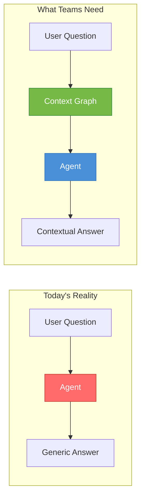

**Slide idea:** Two-column comparison. Left = agent with no memory (red). Right = agent with PulseHQ context (green). Keep it dead simple.

---

## Section 2 — What is PulseHQ? (Simple)

**Key message:** PulseHQ is the contextual memory layer for teams.

### Core Concept

PulseHQ ingests signals from every system a team touches, structures them into a context graph, and exposes that graph to any AI agent via API.

### Signal Sources

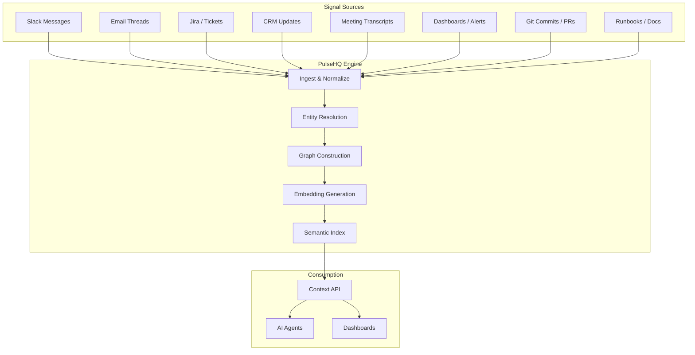

### What Makes It Different

- **Not another RAG pipeline.** PulseHQ builds a structured *graph* — entities, relationships, temporal ordering — not just a vector store.
- **Cross-system.** A single query can traverse a Slack thread → linked Jira ticket → related CRM deal → meeting transcript where the decision was made.
- **Persistent.** The context graph updates continuously, not just at query time.

---

## Section 3 — Architecture Overview (Visual, Conceptual)

**Key message:** Three layers — Ingest, Graph, Serve — each with GPU-accelerated components.

### High-Level Architecture

```mermaid
flowchart TB
    subgraph "Layer 1 — Ingest"
        direction LR
        CON[Connectors<br/>Slack, Email, Jira, CRM]
        NRM[Normalize & Chunk]
        DDP[Dedup & Filter]
    end

    subgraph "Layer 2 — Graph Construction"
        direction LR
        NER[Entity Extraction<br/>🔷 GPU]
        REL[Relationship Linking<br/>🔷 GPU]
        EMB[Embedding Generation<br/>🔷 GPU]
        GDB[(Context Graph<br/>Database)]
        VDB[(Vector Index<br/>🔷 GPU)]
    end

    subgraph "Layer 3 — Serve"
        direction LR
        QE[Query Engine]
        GRT[Graph Traversal +<br/>Semantic Search]
        CTX[Context Assembly]
        CAPI[Context API]
    end

    CON --> NRM --> DDP
    DDP --> NER --> REL --> GDB
    NER --> EMB --> VDB
    GDB & VDB --> QE --> GRT --> CTX --> CAPI

    style NER fill:#76b900,stroke:#5a8c00,color:#fff
    style REL fill:#76b900,stroke:#5a8c00,color:#fff
    style EMB fill:#76b900,stroke:#5a8c00,color:#fff
    style VDB fill:#76b900,stroke:#5a8c00,color:#fff
```

> 🟢 Green blocks = GPU-accelerated on DGX Spark

### What Happens at Each Layer

**Layer 1 — Ingest:** Connectors pull data from source systems. Raw signals are normalized into a common schema, chunked, and deduplicated. This is largely CPU-bound and I/O-bound.

**Layer 2 — Graph Construction:** This is where GPU acceleration matters. Entity extraction (NER models), relationship classification, and embedding generation all run as batch GPU workloads. The outputs populate a graph database (entities + edges) and a vector index (embeddings for semantic search).

**Layer 3 — Serve:** When an agent queries PulseHQ, the query engine performs hybrid retrieval — graph traversal for structured relationships and vector similarity for semantic matches. Results are assembled into a context window and returned via API.

---

## Section 4 — Why DGX Spark? (Connecting to NVIDIA)

**Key message:** Enterprise context must stay at the edge. DGX Spark makes GPU-accelerated context graphs possible inside isolated environments.

### The Edge Context Problem

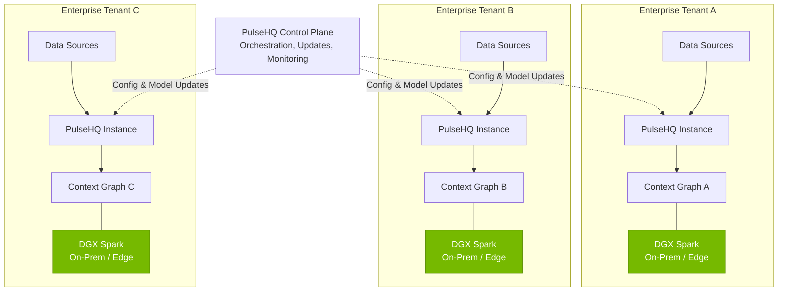

### Why DGX Spark Fits

| Requirement | DGX Spark Capability |
|-------------|---------------------|
| **GPU for NLP pipelines** | GB10 Grace Blackwell Superchip — up to 1 PFLOP FP4 |
| **Large model support** | 128 GB unified memory — run models up to 200B params |
| **Compact form factor** | Desktop-sized, no rack required |
| **Data residency** | Runs entirely on-prem, data never leaves the tenant |
| **NVIDIA AI stack** | CUDA, TensorRT, NIM microservices preinstalled |
| **Networking** | ConnectX-7 200 Gb/s — two Sparks can cluster together |
| **Cost** | ~$3,999 per unit vs. cloud GPU costs |

### Key Talking Point for NVIDIA Advocates

> "DGX Spark isn't just for inference. It's for building *infrastructure*. PulseHQ uses it to run the full context construction pipeline — NER, embeddings, graph building, semantic indexing — inside each tenant's boundary. That's the use case NVIDIA should be highlighting: Spark as the compute layer for AI-native applications at the edge."

---

## Section 5 — Deep Dive: GPU-Accelerated Pipelines (Technical)

**Key message:** Four specific GPU workloads make the context graph fast enough for real-time use.

### Pipeline Detail

```mermaid
flowchart TD
    RAW[Raw Signals<br/>Slack msgs, emails,<br/>tickets, transcripts]

    subgraph "GPU Pipeline on DGX Spark"
        direction TB

        subgraph "Stage 1 — Entity Extraction"
            NER2[NER Model<br/>e.g. DeBERTa / GLiNER]
            ENT[Extracted Entities<br/>People, Projects, Tickets,<br/>Decisions, Dates]
        end

        subgraph "Stage 2 — Relationship Classification"
            RC[Relationship Classifier<br/>e.g. fine-tuned encoder]
            EDGES[Typed Edges<br/>owns, blocked_by,<br/>decided_in, escalated_to]
        end

        subgraph "Stage 3 — Embedding Generation"
            ENC[Embedding Model<br/>e.g. NV-Embed-v2 /<br/>E5-Mistral / BGE]
            VEC[Dense Vectors<br/>768-4096 dim]
        end

        subgraph "Stage 4 — Semantic Indexing"
            IDX[GPU-Accelerated Index<br/>e.g. FAISS-GPU / cuVS]
            ANN[ANN Index<br/>IVF-PQ / HNSW]
        end
    end

    GDB2[(Graph DB<br/>Neo4j / Custom)]
    VDB2[(Vector Store<br/>FAISS / Milvus)]

    RAW --> NER2 --> ENT
    ENT --> RC --> EDGES
    ENT --> ENC --> VEC
    VEC --> IDX --> ANN

    EDGES --> GDB2
    ANN --> VDB2

    style NER2 fill:#76b900,stroke:#5a8c00,color:#fff
    style RC fill:#76b900,stroke:#5a8c00,color:#fff
    style ENC fill:#76b900,stroke:#5a8c00,color:#fff
    style IDX fill:#76b900,stroke:#5a8c00,color:#fff
```

### Stage-by-Stage Breakdown

#### Stage 1 — Entity Extraction

- **Model:** Fine-tuned NER model (DeBERTa-based or GLiNER for zero-shot entity types)
- **Why GPU?** Batch inference over thousands of text chunks per minute. On CPU, this bottlenecks at ~50 chunks/min. On GB10 GPU, you can push 500–1,000+ chunks/min depending on model size.
- **Output:** Typed entities — `Person`, `Project`, `Ticket`, `Decision`, `Deadline`, `Metric`, etc.
- **DGX Spark advantage:** 128 GB unified memory means the NER model, tokenizer, and batch data all fit in memory without swapping. No CPU↔GPU transfer overhead.

#### Stage 2 — Relationship Classification

- **Model:** Fine-tuned sequence classifier or lightweight LLM (7B–13B fits easily on Spark)
- **Task:** Given two entities and surrounding context, classify the relationship type (`owns`, `blocked_by`, `decided_in`, `escalated_to`, `depends_on`)
- **Why GPU?** Pairwise classification over entity pairs scales quadratically. GPU batch inference keeps this tractable.
- **Output:** Typed, directed edges for the graph database

#### Stage 3 — Embedding Generation

- **Model:** NV-Embed-v2, E5-Mistral-7B, or BGE-large depending on requirements
- **Why GPU?** Embedding generation is the highest-throughput GPU workload in the pipeline. Each text chunk produces a dense vector (768–4096 dimensions).
- **DGX Spark throughput:** With NV-Embed-v2, expect ~200–400 embeddings/sec on a single Spark unit for 512-token chunks. This is sufficient for continuous indexing of a mid-size enterprise's daily signal volume.
- **Output:** Dense vectors stored alongside graph nodes

#### Stage 4 — Semantic Indexing

- **Library:** FAISS-GPU or NVIDIA cuVS (CUDA Vector Search)
- **Why GPU?** Building and searching ANN indexes (IVF-PQ, IVF-Flat, HNSW) on GPU is 10–50x faster than CPU for large indexes (>1M vectors).
- **DGX Spark advantage:** cuVS is part of NVIDIA RAPIDS and runs natively on the Spark's CUDA stack. No cloud dependency.
- **Output:** Searchable ANN index for sub-millisecond semantic retrieval

### Hybrid Retrieval at Query Time

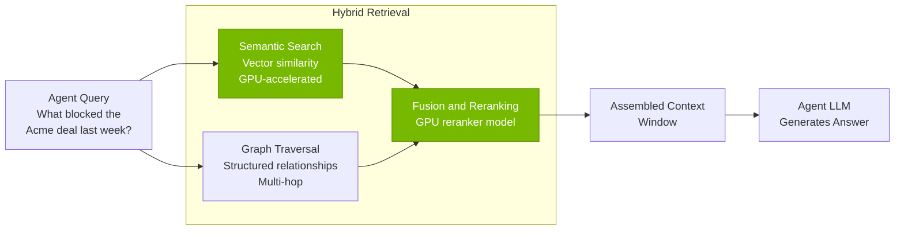

**How it works:**
1. The query is embedded and used for vector similarity search (GPU-accelerated).
2. Extracted entities from the query are used for graph traversal (find related nodes, follow edges).
3. Results from both paths are fused and reranked (optionally with a cross-encoder reranker model on GPU).
4. The final context window is assembled and returned to the agent's LLM.

---

## Section 6 — Tenant Isolation & Edge Deployment (Architecture)

**Key message:** Each enterprise tenant gets their own DGX Spark (or Spark cluster) running an isolated PulseHQ instance. Data never crosses boundaries.

### Multi-Tenant Isolation Architecture

```mermaid
flowchart TB
    subgraph "PulseHQ Control Plane (Cloud)"
        CP_API[Control Plane API]
        CP_REG[Model Registry]
        CP_MON[Monitoring & Telemetry]
        CP_CFG[Config Management]
    end

    subgraph "Tenant A — Financial Services"
        direction TB
        SPA1[DGX Spark #1]
        SPA2[DGX Spark #2]
        SPA1 <-->|ConnectX-7<br/>200 Gb/s| SPA2
        PA_PIPE[PulseHQ Pipeline]
        PA_GRAPH[(Context Graph A)]
        PA_VEC[(Vector Index A)]
        SPA1 & SPA2 --- PA_PIPE
        PA_PIPE --> PA_GRAPH & PA_VEC
        style SPA1 fill:#76b900,stroke:#5a8c00,color:#fff
        style SPA2 fill:#76b900,stroke:#5a8c00,color:#fff
    end

    subgraph "Tenant B — Healthcare"
        direction TB
        SPB1[DGX Spark #1]
        PB_PIPE[PulseHQ Pipeline]
        PB_GRAPH[(Context Graph B)]
        PB_VEC[(Vector Index B)]
        SPB1 --- PB_PIPE
        PB_PIPE --> PB_GRAPH & PB_VEC
        style SPB1 fill:#76b900,stroke:#5a8c00,color:#fff
    end

    subgraph "Tenant C — Defense / Air-Gapped"
        direction TB
        SPC1[DGX Spark #1]
        SPC2[DGX Spark #2]
        SPC1 <-->|ConnectX-7| SPC2
        PC_PIPE[PulseHQ Pipeline]
        PC_GRAPH[(Context Graph C)]
        PC_VEC[(Vector Index C)]
        SPC1 & SPC2 --- PC_PIPE
        PC_PIPE --> PC_GRAPH & PC_VEC
        style SPC1 fill:#76b900,stroke:#5a8c00,color:#fff
        style SPC2 fill:#76b900,stroke:#5a8c00,color:#fff
    end

    CP_API -.->|Config sync<br/>Model updates| PA_PIPE & PB_PIPE
    CP_MON -.->|Telemetry<br/>no raw data| PA_PIPE & PB_PIPE
    PC_PIPE -.->|Air-gapped<br/>Manual updates| CP_REG

    style CP_API fill:#4a90d9,stroke:#2c6fbb,color:#fff
    style CP_REG fill:#4a90d9,stroke:#2c6fbb,color:#fff
    style CP_MON fill:#4a90d9,stroke:#2c6fbb,color:#fff
    style CP_CFG fill:#4a90d9,stroke:#2c6fbb,color:#fff
```

### Isolation Strategies

| Strategy | Description | Use Case |
|----------|-------------|----------|
| **Physical isolation** | Dedicated DGX Spark per tenant. No shared hardware. | Financial services, healthcare, defense |
| **Network isolation** | Spark sits behind tenant's firewall. PulseHQ control plane communicates over encrypted tunnel (WireGuard/Tailscale). | Standard enterprise |
| **Air-gapped** | No network connection to control plane. Model updates shipped via encrypted USB or secure transfer. | Defense, classified environments |
| **Spark clustering** | Two Sparks linked via ConnectX-7 (200 Gb/s) for larger tenants. Doubles memory to 256 GB, enables larger models. | Large enterprise with high signal volume |

### Deployment Lifecycle

```mermaid
sequenceDiagram
    participant CP as Control Plane
    participant SPARK as DGX Spark (Tenant)
    participant SRC as Data Sources

    CP->>SPARK: Deploy PulseHQ container image
    CP->>SPARK: Push model weights (NER, embeddings, reranker)
    CP->>SPARK: Push tenant config (connectors, schema, policies)
    SPARK->>SRC: Establish connector auth (OAuth, API keys)
    loop Continuous Operation
        SRC->>SPARK: Stream signals (Slack, email, Jira...)
        SPARK->>SPARK: GPU pipeline: extract → link → embed → index
        SPARK->>CP: Telemetry (latency, throughput, errors — no raw data)
    end
    Note over CP,SPARK: Model updates pushed periodically
    CP->>SPARK: Updated model weights
    SPARK->>SPARK: Hot-reload models, re-index if needed
```

---

## Section 7 — Cost Considerations (Practical)

### DGX Spark vs. Cloud GPU Costs

| Scenario | DGX Spark | Cloud GPU (A100 equivalent) |
|----------|-----------|---------------------------|
| **Hardware cost** | ~$3,999 one-time | $2.50–$4.00/hr (on-demand) |
| **Monthly cost (24/7)** | ~$50 electricity | ~$1,800–$2,900/month |
| **Break-even** | ~2 months of continuous use | — |
| **Data residency** | On-prem by default | Requires private cloud config |
| **Maintenance** | Minimal (Ubuntu, OTA updates) | Cloud provider managed |
| **Scaling** | Add a second Spark (~$4K) | Increase instance size |

### Cost Model for Multi-Tenant Deployment

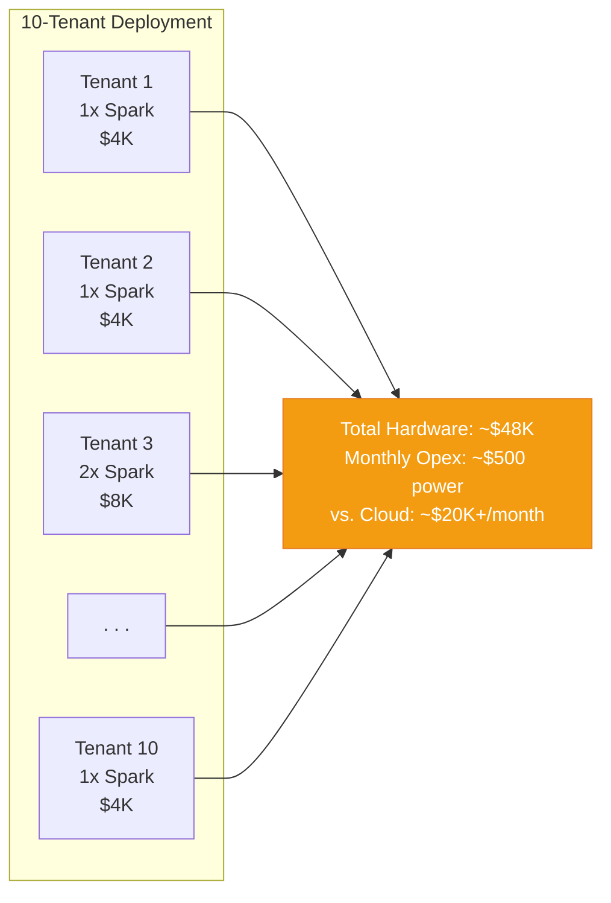

### Key Cost Arguments

- **Break-even in ~2 months** vs. equivalent cloud GPU for always-on workloads.
- **Predictable cost.** Hardware is a one-time capital expense. No surprise GPU bills.
- **Data gravity.** For enterprises that already keep data on-prem, adding DGX Spark avoids the cost and compliance burden of moving data to the cloud.
- **Scale linearly.** Each tenant gets their own Spark. No noisy-neighbor problems. No shared GPU contention.

---

## Preparing for "Why NVIDIA?" Questions

Since this is for NVIDIA developer advocates, they'll likely ask pointed questions about why PulseHQ chose NVIDIA / DGX Spark. Here are prepared answers:

### Q: Why not just run this on a Mac Studio with Apple Silicon?

**A:** Three reasons:

1. **CUDA ecosystem.** PulseHQ's pipeline uses FAISS-GPU, cuVS, TensorRT for optimized inference, and RAPIDS for data processing. None of these run on Apple Silicon.
2. **Unified memory with CUDA.** Mac Studio has unified memory too, but you can't run CUDA workloads on it. DGX Spark's 128 GB is accessible to both CPU and GPU compute — meaning our NER models, embedding models, and vector indexes all share the same memory pool with zero-copy access.
3. **Networking.** ConnectX-7 with 200 Gb/s enables two-Spark clustering. No equivalent on Mac.

### Q: Why not use cloud GPUs?

**A:**

1. **Data residency.** Enterprise customers in finance, healthcare, and defense require data to stay on-prem. Cloud GPU means data leaves the building.
2. **Cost at steady state.** Context graphs run 24/7. Cloud GPU costs for always-on workloads are 10–20x higher than owning a Spark over 12 months.
3. **Latency.** Agents querying the context graph need sub-100ms responses. Local compute eliminates cloud round-trip.

### Q: Why not use a traditional server with discrete GPUs?

**A:**

1. **Form factor.** DGX Spark fits on a desk or in a small office. Enterprise tenants don't all have server rooms.
2. **Managed stack.** NVIDIA AI software stack comes preinstalled. No driver hell, no CUDA version mismatches.
3. **Power efficiency.** ~100W TDP vs. 300–700W for a discrete GPU server. Important for edge/office deployment.

### Q: Can you really run production workloads on DGX Spark?

**A:** PulseHQ's pipeline is not training large models — it's running inference on specialized NER/embedding models (typically 300M–7B parameters) and building vector indexes. These are exactly the workloads DGX Spark is designed for. The 128 GB unified memory means we can keep the full pipeline (multiple models + index + graph) resident in memory without swapping.

For tenants with very high signal volume, two Sparks can be clustered to double throughput and memory.

### Q: What NVIDIA software stack components does PulseHQ use?

**A:**

| Component | Use in PulseHQ |
|-----------|---------------|
| **CUDA** | Core compute for all GPU workloads |
| **TensorRT** | Optimized inference for NER and embedding models |
| **cuVS (RAPIDS)** | GPU-accelerated vector similarity search |
| **FAISS-GPU** | ANN index building and search |
| **NIM Microservices** | Optional: deploy NV-Embed-v2 or other models as NIM endpoints on the Spark |
| **Triton Inference Server** | Model serving with batching and concurrency |
| **NCCL** | Multi-Spark communication for clustered deployments |
| **ConnectX-7** | High-speed networking for Spark-to-Spark links |

### Q: How does PulseHQ handle model updates on deployed Sparks?

**A:** The PulseHQ control plane manages a model registry. When we fine-tune or update a model (e.g., improved NER for a specific domain), the updated weights are pushed to tenant Sparks over an encrypted channel. The Spark performs a hot-reload — the new model is loaded into memory while the old one continues serving, then traffic is switched. For air-gapped deployments, updates are shipped via encrypted transfer media.

### Q: What's the latency profile?

**A:** End-to-end query latency (agent asks a question → context returned):

| Operation | Latency |
|-----------|---------|
| Query embedding | ~5–15 ms |
| Vector search (FAISS-GPU, 1M vectors) | ~1–5 ms |
| Graph traversal (2–3 hops) | ~10–30 ms |
| Reranking (cross-encoder, top 20 results) | ~20–50 ms |
| Context assembly | ~5 ms |
| **Total** | **~40–100 ms** |

This is well within the latency budget for real-time agent queries.

---

## Appendix A — Full System Architecture (Detailed)

```mermaid
flowchart TB
    subgraph "Data Sources"
        S1[Slack API]
        S2[Gmail / O365]
        S3[Jira / Linear]
        S4[Salesforce / HubSpot]
        S5[Meeting Bots<br/>Zoom, Teams]
        S6[Datadog / PagerDuty]
        S7[GitHub / GitLab]
        S8[Confluence / Notion]
    end

    subgraph "Ingest Layer"
        WH[Webhook Receivers]
        POLL[Polling Connectors]
        AUTH[Auth Manager<br/>OAuth, API Keys]
        NORM[Normalizer<br/>Common Schema]
        CHUNK[Chunker<br/>Semantic Splitting]
        DDP2[Dedup Engine<br/>MinHash / SimHash]
        Q1[(Ingest Queue<br/>Redis / NATS)]
    end

    subgraph "GPU Pipeline — DGX Spark"
        direction TB
        BATCH[Batch Scheduler]

        subgraph "NER Stage"
            NER3[Entity Extraction<br/>DeBERTa / GLiNER]
            ENT2[Entity Store]
        end

        subgraph "Relation Stage"
            REL2[Relation Classifier<br/>Fine-tuned Encoder]
            EDGE2[Edge Store]
        end

        subgraph "Embedding Stage"
            EMB2[Embedding Model<br/>NV-Embed-v2]
            VEC2[Vector Store]
        end

        subgraph "Indexing Stage"
            FAISS[FAISS-GPU /<br/>cuVS Index]
        end

        subgraph "Optional: Local LLM"
            LLM[Llama 3.1 70B /<br/>Qwen3 on Spark<br/>for summarization]
        end
    end

    subgraph "Storage Layer"
        GDB3[(Graph DB<br/>Neo4j / TigerGraph)]
        VDB3[(Vector Index<br/>FAISS / Milvus)]
        META[(Metadata Store<br/>PostgreSQL)]
        BLOB[(Blob Store<br/>Raw Documents)]
    end

    subgraph "Query & Serve Layer"
        QE2[Query Parser]
        QP[Query Planner]
        GQ[Graph Query Engine]
        VQ[Vector Query Engine]
        FUS[Fusion Engine]
        RR[Reranker<br/>Cross-Encoder]
        CA[Context Assembler]
        RATE[Rate Limiter]
        CACHE[Response Cache]
        CAPI2[Context API<br/>REST / gRPC]
    end

    subgraph "Agent Integration"
        SDK[PulseHQ SDK<br/>Python / TypeScript]
        HOOK[Agent Hooks<br/>LangChain, CrewAI,<br/>AutoGen, Custom]
        MCP[MCP Server<br/>Anthropic Protocol]
    end

    S1 & S2 & S3 & S4 --> WH
    S5 & S6 & S7 & S8 --> POLL
    WH & POLL --> AUTH --> NORM --> CHUNK --> DDP2 --> Q1
    Q1 --> BATCH
    BATCH --> NER3 --> ENT2
    ENT2 --> REL2 --> EDGE2
    ENT2 --> EMB2 --> VEC2
    VEC2 --> FAISS
    EDGE2 --> GDB3
    FAISS --> VDB3
    ENT2 --> META
    NORM --> BLOB
    LLM -.->|Optional summarization| ENT2

    CAPI2 --> QE2 --> QP
    QP --> GQ & VQ
    GQ --> GDB3
    VQ --> VDB3
    GQ & VQ --> FUS --> RR --> CA
    CA --> RATE --> CACHE --> CAPI2

    CAPI2 --> SDK --> HOOK & MCP

    style NER3 fill:#76b900,stroke:#5a8c00,color:#fff
    style REL2 fill:#76b900,stroke:#5a8c00,color:#fff
    style EMB2 fill:#76b900,stroke:#5a8c00,color:#fff
    style FAISS fill:#76b900,stroke:#5a8c00,color:#fff
    style RR fill:#76b900,stroke:#5a8c00,color:#fff
    style LLM fill:#76b900,stroke:#5a8c00,color:#fff
```

---

## Appendix B — Context Graph Data Model

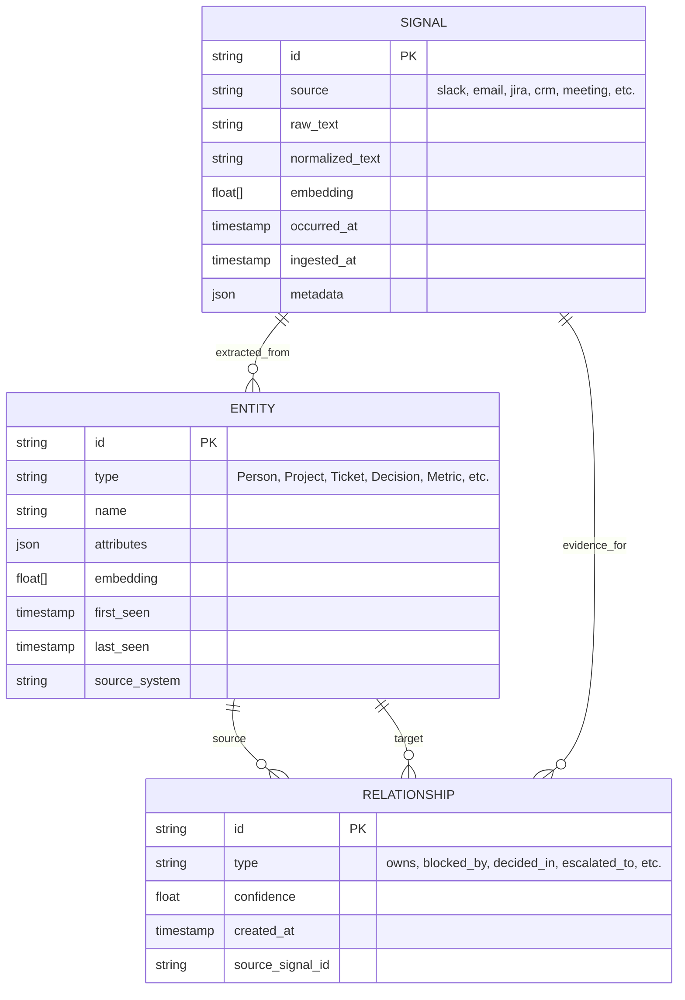

---

## Appendix C — DGX Spark Quick Reference

| Spec | Value |
|------|-------|
| **Chip** | NVIDIA GB10 Grace Blackwell Superchip |
| **CPU** | 20 ARM cores (10x Cortex-X925 + 10x Cortex-A725) |
| **GPU** | Blackwell GPU, 5th gen Tensor Cores |
| **AI Performance** | Up to 1 PFLOP FP4 (sparse) |
| **Memory** | 128 GB unified LPDDR5x |
| **Memory Bandwidth** | 273 GB/s |
| **Storage** | 4 TB NVMe SSD (Founder's Edition) |
| **Networking** | ConnectX-7 (2x QSFP, 200 Gb/s) + 10 GbE RJ-45 |
| **Form Factor** | Desktop (similar to Mac Mini, slightly larger) |
| **Power** | ~100W TDP, USB-C power delivery |
| **OS** | Ubuntu, NVIDIA AI stack preinstalled |
| **Price** | ~$3,999 |
| **Clustering** | Two units via ConnectX-7 for 256 GB combined memory |
| **Model Support** | Inference up to 200B params, fine-tune up to 70B params |

---

## Appendix D — Presentation Flow Cheat Sheet

Use this as your speaker notes outline:

### Opening (0–3 min)
- "Everyone's building agents. Nobody's building memory."
- Quick pain point: agent that can't remember what your team decided last week
- PulseHQ = the contextual memory layer

### PulseHQ Overview (3–7 min)
- Show signal sources diagram
- "We ingest from everywhere, structure into a graph, and serve context to any agent"
- Differentiate from simple RAG: graph, not just vectors

### Architecture (7–12 min)
- Three-layer diagram: Ingest → Graph → Serve
- Highlight GPU blocks in green
- "Four GPU workloads: entity extraction, relationship classification, embeddings, semantic indexing"

### Why DGX Spark (12–16 min)
- Tenant isolation diagram
- "Enterprise data can't leave the building. DGX Spark is the GPU at the edge."
- Specs table — 128 GB, 1 PFLOP, $3,999
- Compare to cloud costs

### Deep Dive (16–22 min)
- Walk through the 4-stage GPU pipeline
- Mention specific models and throughput numbers
- Show hybrid retrieval diagram
- Latency table: ~40–100ms end-to-end

### Tenant Isolation (22–26 min)
- Multi-tenant architecture diagram
- Physical isolation, network isolation, air-gapped options
- Spark clustering for large tenants
- Deployment lifecycle sequence diagram

### Cost & Wrap-Up (26–28 min)
- Cost comparison table
- Break-even in ~2 months
- "DGX Spark as infrastructure compute, not just inference"

### Q&A (28–30 min)
- Refer to the prepared Q&A section above
- Anticipate "why not Mac/cloud/server" questions

---

*Document prepared for PulseHQ presentation to NVIDIA Developer Advocates*
*Duration: 30 minutes | Format: Architecture-focused, no live demo required*
